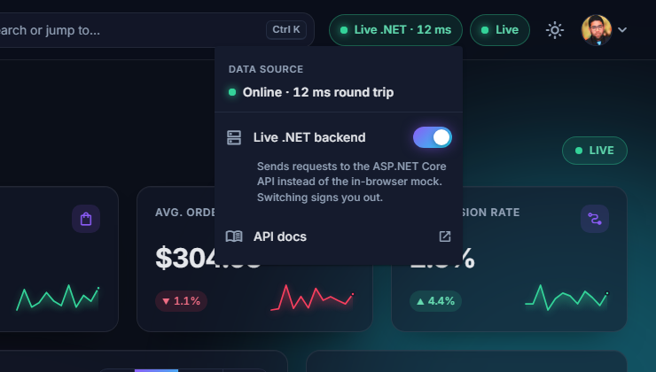

# Nebula Commerce

An e-commerce admin dashboard built with Angular 22: orders, fulfillment, catalog, customers and
analytics in a dark, glass-style interface. Everything runs in the browser against a mock HTTP
backend by default, so the demo needs no server and no sign-up; one switch moves it to the
[live .NET backend](#live-net-backend).

[](https://github.com/antryas/nebula-commerce/actions/workflows/deploy.yml)


**[Live demo](https://antryas.github.io/nebula-commerce/)** · Demo account: `alex@nebula.store` /
`demo1234` (prefilled on the sign-in page)

The public demo counts visits with Cloudflare Web Analytics (cookieless, no personal data).


## Features

**Dashboard and charts**

- KPI cards with count-up values, trend deltas and sparklines
- Revenue chart (7 / 30 / 90 days, 12 months), sales by category, top products
- Analytics page: revenue vs. orders, world map of sales by country, orders-by-hour heatmap,
  conversion funnel

**Orders and fulfillment**

- Server-side paging, sorting, debounced search, status and date-range filters
- Bulk status updates, CSV export, order details with a status timeline
- Drag-and-drop fulfillment board (New → Packing → Shipped → Delivered) with optimistic updates
  and rollback on error
- Simulated live orders that arrive every few seconds with toasts and row highlights

**Products and customers**

- Catalog as a card grid or table, category / stock filters
- Product editor built on a typed reactive form: validation, variants, image upload preview,
  live card preview, unsaved-changes guard
- Customer list and profile with lifetime value and order history

**AI with cost control built in**

- **Ask Nebula AI** panel (topbar button or "Ask AI" in the palette): a chat drawer with suggested
  questions about top products, revenue, unshipped orders and best customers, answered from store
  data. Shows which data tools an answer used and keeps the last 6 messages as context.
- **Generate with AI** in the product editor: a description from name, category and tone
  (friendly, premium, playful) that behaves like a normal edit (unsaved-changes guard included).
- Two modes behind one `/api/ai` contract. The mock serves **recorded** answers templated from the
  mock database, so the public demo never calls a model and costs nothing. The live .NET backend
  answers with **DeepSeek**, capped by a daily per-user quota (shown as "12 of 20 left today") and
  rate limiting; when the quota runs out it falls back to recorded answers and the panel says so.
- Provider-agnostic: the UI only knows the contract (`answer`, `mode`, `toolsUsed`, `quota`), so the
  model can change on the server without touching the frontend. Answers render through a small
  markdown subset (paragraphs, bullets, bold) built from template nodes, never `innerHTML`.

**UX details**

- `Ctrl K` command palette: jump to pages, run actions, search orders, products and customers
- Dark and light themes plus four accent colors, remembered per browser
- Skeleton loaders, empty and error states with retry, toast notifications
- Responsive down to 375 px, keyboard accessible, respects `prefers-reduced-motion`

## Tech stack

| Area      | Choice                                                                    |
| --------- | ------------------------------------------------------------------------- |
| Framework | Angular 22: standalone components, zoneless change detection, signals     |
| UI        | Angular Material and CDK (tables, date picker, drag and drop), Tailwind 4 |
| Charts    | ECharts 6 via ngx-echarts, loaded lazily                                  |
| Data      | `HttpClient` + RxJS at the HTTP boundary, signals for state (no NgRx)     |
| Mock data | Faker with a fixed seed: 60 products, 700 customers, 4,800 orders         |
| Quality   | Vitest unit tests, Playwright end-to-end smoke test, ESLint, Prettier     |
| Delivery  | GitHub Actions → GitHub Pages                                             |

## Architecture

```
src/app/
  core/          app-wide services: typed API clients, auth, HTTP error handling,
                 theme, toasts, live orders, command palette, AI assistant, layout shell
  shared/        UI kit (cards, KPI, charts theme, skeletons, states), directives, pipes
  features/      one lazy-loaded folder per page: overview, orders, fulfillment,
                 products, customers, analytics, settings, login
  models/        domain types shared by the UI and the API layer
  mock-api/      in-memory backend used by the demo (never imported by features)
```

Pages depend only on typed API services in `core/api/` (`OrdersApi`, `ProductsApi`, ...), which
call REST endpoints under `ApiConfigService.baseUrl()` with `HttpClient`. Nothing in the UI knows the
data is fake.

### How the mock API works

- `app.config.ts` always registers `mockApiInterceptor`. While the data source is **mock** (the
  default, persisted in `localStorage` under `nebula.backend`), it catches requests to
  `environment.apiUrl` and answers them from an in-memory
  database seeded by Faker (seed `42`), so every visitor sees the same data.
- It simulates real network behavior: 150–450 ms latency and a 3% chance of a `500` on list
  requests, which exercises the loading, error and retry states. `?screenshot=1` turns both off.
- Handlers support paging, sorting, filtering and validation errors (`422`) like a real REST API.
  Writes (status changes, product edits) persist until the page is reloaded or the demo data is
  reset in Settings.
- The backend code, including Faker, is a separate chunk loaded on the first request, so it
  stays out of the initial bundle.

## Live .NET backend

The same UI can run against a real server: [**nebula-api**](https://github.com/antryas/nebula-api),
an ASP.NET Core Web API (EF Core + SQLite) that implements this exact `/api` contract.

- The topbar pill shows the data source: **Mock data**, **Live .NET · 42 ms** (green, measured
  health-check latency) or **API offline** (red). Click it to open a menu with the
  **Live .NET backend** switch and a link to the API docs (Swagger UI). The same switch is in
  **Settings → Data source** and in the <kbd>Ctrl</kbd>+<kbd>K</kbd> palette.
- Switching is instant (no rebuild): API clients read `ApiConfigService.baseUrl()` per request,
  the mock interceptor steps aside in live mode, and an auth interceptor sends the JWT as a bearer
  token. The choice is stored in `localStorage` (`nebula.backend`).
- A session belongs to the backend that issued it, so switching signs you out and opens the login
  page (demo credentials are pre-filled). A `401` from the live API does the same.
- While live, the app pings `/health` every 30 s. If the live API is unreachable at startup, the
  app falls back to mock data and says so.
- **The public live demo is read-only.** The server still validates every write and answers with
  the resulting entity, but saves nothing (those responses carry `X-Nebula-Dry-Run: true`, and
  `GET /api/demo/mode` reports `{ "readOnly": true }`). `demoOverlayInterceptor` keeps these
  results in `sessionStorage` and lays them over list and detail reads, so product edits, new and
  deleted products, order status changes and bulk updates stick in your tab while other visitors
  always see the same data. Totals, KPIs and analytics stay as the server reports them. The
  changes are dropped on sign-out, on switching backend, or with **Settings → Discard my
  changes**.
- If the live API has no working `/api/ai` endpoints (an older deployment answers `404`, or it
  fails with `5xx`), the AI features fall back to the in-browser recorded answers.

Run both locally:

```bash
# terminal 1: the API on http://localhost:5080 (Swagger UI at /swagger)
git clone https://github.com/antryas/nebula-api
dotnet run --project nebula-api/src/Nebula.Api

# terminal 2: this app; the dev build points live mode at http://localhost:5080/api
npm start
```

Then click **Mock data** in the topbar and turn on **Live .NET backend**. The live API URL per
build lives in `liveApiUrl` in `src/environments/environment*.ts`.

## Getting started

Requires Node.js 22.22+ or 24.15+.

```bash
npm ci
npm start          # dev server at http://localhost:4200
npm test           # unit tests (Vitest, watch mode; add -- --watch=false for a single run)
npm run e2e        # Playwright smoke test (starts its own server on port 4300)
npm run build      # production build in dist/
```

`npm run screenshots` regenerates the images in `portfolio/screenshots/`.

## Screenshots



| Orders                                              | Fulfillment board                                             |
| --------------------------------------------------- | ------------------------------------------------------------- |
|  |  |

| Product editor                                                    | Light theme                                                 |
| ----------------------------------------------------------------- | ----------------------------------------------------------- |
|  |  |

## License

[MIT](LICENSE) © Anton R.
