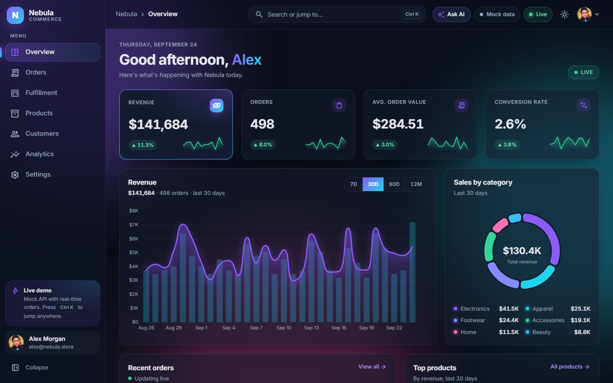
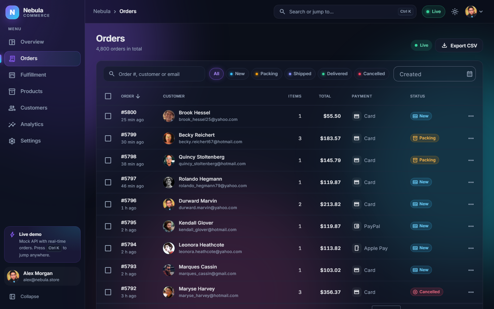
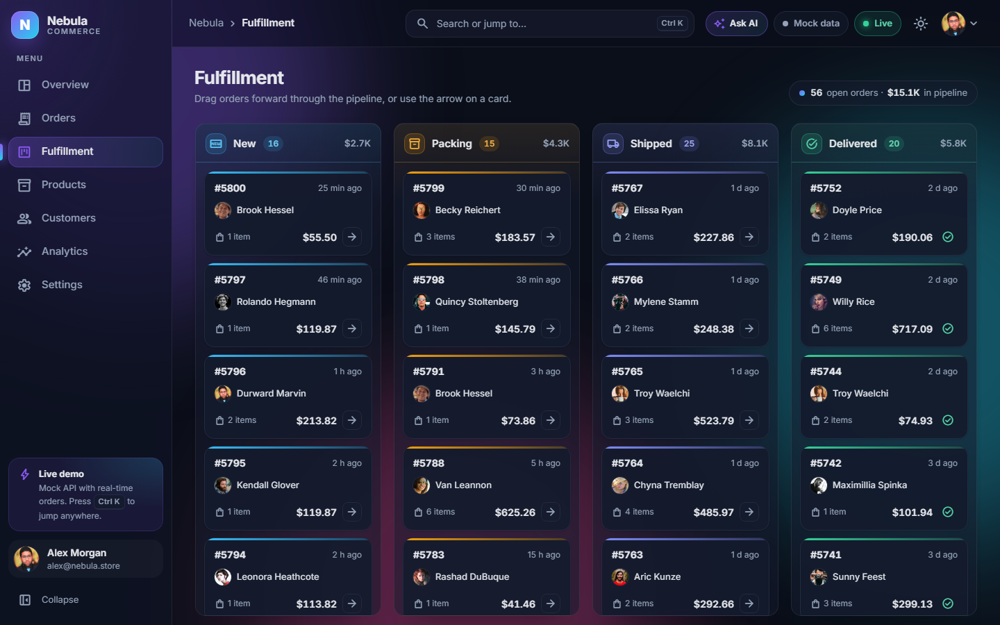
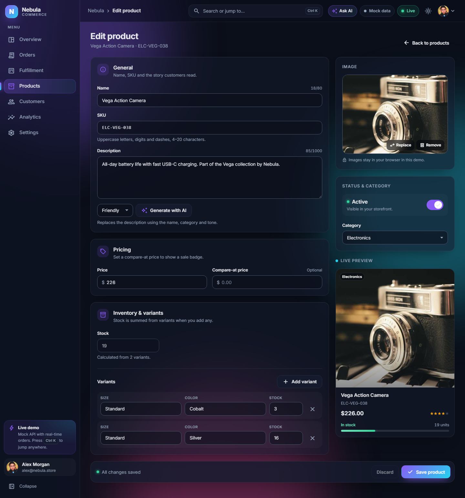
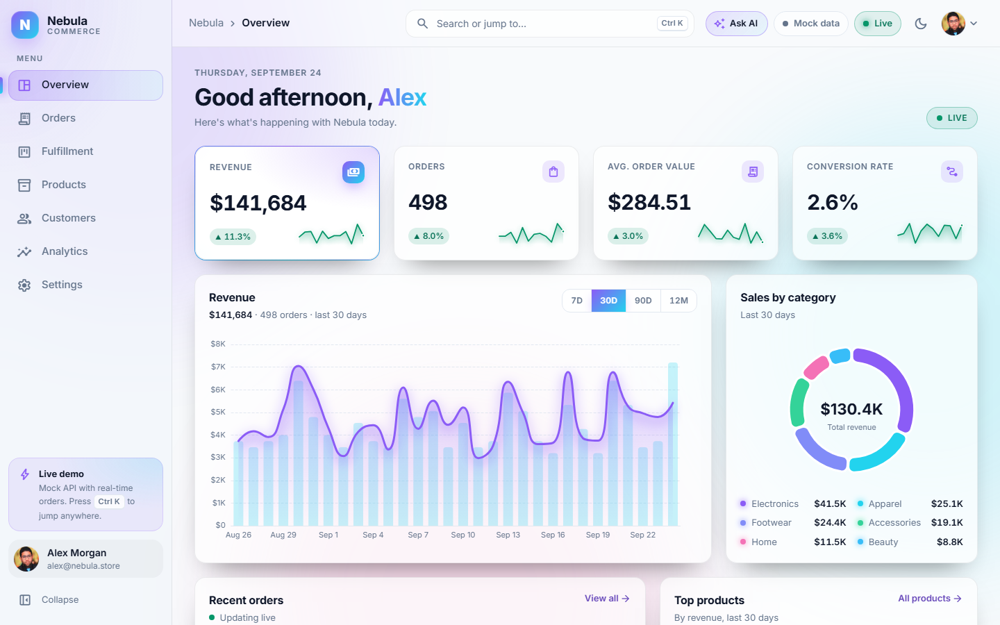

# Nebula Commerce

An e-commerce admin dashboard built with Angular 22: orders, fulfillment, catalog, customers and
analytics in a dark, glass-style interface. Everything runs in the browser against a mock HTTP
backend, so the demo needs no server and no sign-up.

[](https://github.com/antryas/nebula-commerce/actions/workflows/deploy.yml)


**[Live demo](https://antryas.github.io/nebula-commerce/)** · Demo account: `alex@nebula.store` /
`demo1234` (prefilled on the sign-in page)



## Features

**Dashboard and charts**

- KPI cards with count-up values, trend deltas and sparklines
- Revenue chart (7 / 30 / 90 days, 12 months), sales by category, top products
- Analytics page: revenue vs. orders, world map of sales by country, orders-by-hour heatmap,
  conversion funnel

**Orders and fulfillment**

- Server-side paging, sorting, debounced search, status and date-range filters
- Bulk status updates, CSV export, order details with a status timeline
- Drag-and-drop fulfillment board (New → Packing → Shipped → Delivered) with optimistic updates
  and rollback on error
- Simulated live orders that arrive every few seconds with toasts and row highlights

**Products and customers**

- Catalog as a card grid or table, category / stock filters
- Product editor built on a typed reactive form: validation, variants, image upload preview,
  live card preview, unsaved-changes guard
- Customer list and profile with lifetime value and order history

**UX details**

- `Ctrl K` command palette: jump to pages, run actions, search orders, products and customers
- Dark and light themes plus four accent colors, remembered per browser
- Skeleton loaders, empty and error states with retry, toast notifications
- Responsive down to 375 px, keyboard accessible, respects `prefers-reduced-motion`

## Tech stack

| Area      | Choice                                                                    |
| --------- | ------------------------------------------------------------------------- |
| Framework | Angular 22: standalone components, zoneless change detection, signals     |
| UI        | Angular Material and CDK (tables, date picker, drag and drop), Tailwind 4 |
| Charts    | ECharts 6 via ngx-echarts, loaded lazily                                  |
| Data      | `HttpClient` + RxJS at the HTTP boundary, signals for state (no NgRx)     |
| Mock data | Faker with a fixed seed: 60 products, 700 customers, 4,800 orders         |
| Quality   | Vitest unit tests, Playwright end-to-end smoke test, ESLint, Prettier     |
| Delivery  | GitHub Actions → GitHub Pages                                             |

## Architecture

```
src/app/
  core/          app-wide services: typed API clients, auth, HTTP error handling,
                 theme, toasts, live orders, command palette, layout shell
  shared/        UI kit (cards, KPI, charts theme, skeletons, states), directives, pipes
  features/      one lazy-loaded folder per page: overview, orders, fulfillment,
                 products, customers, analytics, settings, login
  models/        domain types shared by the UI and the API layer
  mock-api/      in-memory backend used by the demo (never imported by features)
```

Pages depend only on typed API services in `core/api/` (`OrdersApi`, `ProductsApi`, ...), which
call REST endpoints under `ApiConfigService.baseUrl()` with `HttpClient`. Nothing in the UI knows the
data is fake.

### How the mock API works

- `app.config.ts` always registers `mockApiInterceptor`. While the data source is **mock** (the
  default, persisted in `localStorage` under `nebula.backend`), it catches requests to
  `environment.apiUrl` and answers them from an in-memory
  database seeded by Faker (seed `42`), so every visitor sees the same data.
- It simulates real network behavior: 150–450 ms latency and a 3% chance of a `500` on list
  requests, which exercises the loading, error and retry states. `?screenshot=1` turns both off.
- Handlers support paging, sorting, filtering and validation errors (`422`) like a real REST API.
  Writes (status changes, product edits) persist until the page is reloaded or the demo data is
  reset in Settings.
- The backend code, including Faker, is a separate chunk loaded on the first request, so it
  stays out of the initial bundle.

### Switching to a real backend

1. Point `liveApiUrl` at the server in `src/environments/environment*.ts` and switch
   `ApiConfigService` to `live` mode at runtime (no rebuild needed).
2. Implement the same endpoints: `/auth/login`, `/orders`, `/products`, `/customers`,
   `/analytics/*`. The request and response shapes are the types in `src/app/models/`.

Components and API services stay unchanged; with token-based auth, the only addition is a small
interceptor that attaches the token returned by `/auth/login`. A companion **ASP.NET Core Web
API** backend implementing this contract is **planned**.

## Getting started

Requires Node.js 22.22+ or 24.15+.

```bash
npm ci
npm start          # dev server at http://localhost:4200
npm test           # unit tests (Vitest, watch mode; add -- --watch=false for a single run)
npm run e2e        # Playwright smoke test (starts its own server on port 4300)
npm run build      # production build in dist/
```

`npm run screenshots` regenerates the images in `portfolio/screenshots/`.

## Screenshots

| Orders                                              | Fulfillment board                                             |
| --------------------------------------------------- | ------------------------------------------------------------- |
|  |  |

| Product editor                                                    | Light theme                                                 |
| ----------------------------------------------------------------- | ----------------------------------------------------------- |
|  |  |

## License

[MIT](LICENSE) © Anton R.
